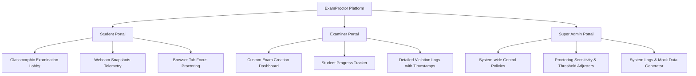

# Project Pitch: ExamProctor
## Secure Assessment & Automated Proctoring Network

---

## 📌 Elevator Pitch
**ExamProctor** is a production-grade, full-stack, secure online examination portal designed to solve academic integrity and operational overhead in remote testing. It automates exam administration, real-time proctoring (browser tab focus-tracking and webcam snapshot telemetry), grading management, and system configuration, all built on top of a fully containerized, automated CI/CD pipeline.

---

## 🛑 The Problem We Are Solving
1. **Academic Dishonesty in Remote Testing:** Students frequently switch tabs, research answers, or copy-paste content during online exams.
2. **High Proctoring Overhead:** Traditional proctoring requires active human supervision, which is expensive and doesn't scale.
3. **Fragmented Workflows:** Grading, student records, exam creation, and proctoring telemetry are usually scattered across different, unconnected tools.
4. **Configuration Drift & Deployment Complexity:** Setting up complex multi-service applications on diverse environments introduces deployment errors.

---

## 💡 The Solution: ExamProctor
ExamProctor consolidates the entire assessment lifecycle into a single secure platform:
*   **For Students:** A frictionless, glassmorphic examination lobby.
*   **For Educators (Examiners):** A customized test creator and real-time proctoring violation timeline.
*   **For Administrators:** A centralized control tower managing system policies, proctoring sensitivity thresholds, and database maintenance.
*   **For DevOps/Infrastructure:** A zero-touch deployment workflow driven by Docker Compose and Jenkins pipelines.

---

## 🛠️ The Tech Stack

### 🎨 Frontend
*   **React.js (v19):** Declarative component-based UI with global context engines (`AuthContext`, `ExamContext`).
*   **Vite:** High-performance local development build tool.
*   **Vanilla CSS:** Glassmorphism design tokens for a premium, sleek user experience.
*   **React Router DOM:** Client-side routing with route guards to restrict unauthorized access.
*   **Axios:** Promised-based API client featuring automated JWT authentication injection interceptors.

### ⚙️ Backend
*   **Node.js & Express.js:** Fast, asynchronous, event-driven RESTful API endpoints.
*   **JWT (JSON Web Tokens):** Secure, stateless user sessions stored client-side.
*   **Bcrypt:** Industry-standard password hashing.
*   **SQLite3:** Local database engine (with native promise wrappers) mapped to persistent Docker volumes. The database architecture is designed to easily migrate to **MongoDB** (via Mongoose ODM) for production scale.

### 🐳 DevOps & Infrastructure
*   **Docker & Docker Compose:** Encapsulates the frontend, backend, and proxy services into isolated, lightweight container states.
*   **Nginx:** High-performance web server hosting static React files and serving as a reverse proxy mapping `/api` endpoints directly to the backend.
*   **Jenkins:** Declarative CI/CD pipeline automating integration and deployment cycles.
*   **GitHub Webhooks & Ngrok:** Automated trigger system tunneling local repository commits directly to the Jenkins build system.
*   **Docker Hub:** Container registry storing and serving the production-ready Docker images.

---

## ⚡ Key Modules & Features

### 1. The Student Portal
*   **Smart Proctoring:** Registers event listeners (`visibilitychange` and `blur`) to detect when a student leaves the exam window.
*   **Automatic Warnings:** If the student switches tabs, they receive warnings. If they exceed the examiner-defined threshold, the system **auto-submits** the exam immediately to prevent cheating.
*   **Webcam Snapshots:** Requests permission to capture webcam photos at random intervals during the exam, saving them to the backend server to prevent impersonation.

### 2. The Examiner Portal
*   **Exam Builder:** Create and configure customized exams (timing, subjects, rules).
*   **Submissions & Grading:** Review and grade student submissions in real-time.
*   **Violation Logs:** Access a detailed proctoring violation timeline. Every single tab-switch event is logged with precise timestamps.

### 3. The Super Admin Portal
*   **Central Policy Settings:** Toggle registration controls, adjust proctoring sensitivity, and manage platform alerts.
*   **System Maintenance:** One-click tools to safely wipe logs, reset databases, or populate the platform with mock data.
*   **Usage Analytics:** Interactive charts showing grade distribution and exam statistics.

---

## 🔄 The Automated Jenkins Workflow
ExamProctor features a modern **Continuous Integration and Continuous Deployment (CI/CD)** pipeline that compiles, tests, containerizes, and deploys code with zero downtime:

```mermaid
flowchart LR
    Dev[Developer Machine] -->|git push| GitHub[GitHub Repo]
    GitHub -->|Webhook Push Event| Ngrok[Ngrok Tunnel]
    Ngrok -->|Forward Payload| Jenkins[Jenkins CI Server]
    subgraph Jenkins Pipeline
        Jenkins --> Checkout[1. SCM Checkout]
        Checkout --> Verify[2. Verify Env]
        Verify --> Install[3. Install Deps]
        Install --> Build[4. Build Frontend]
        Build --> DockerBuild[5. Build Images]
        DockerBuild --> Push[6. Push to Registry]
    end
    Push --> DockerHub[(Docker Hub Registry)]
    DockerHub --> Pull[7. Pull Latest Images]
    Pull --> Compose[8. Docker Compose Deploy]
    Compose --> Production[Production Containers]
```

### The 13-Stage Build & Deploy Cycle:
1.  **SCM Checkout:** Pulls code from GitHub.
2.  **Verify Environment:** Runs checks on local node, npm, and docker setups.
3.  **Install Frontend Dependencies:** Installs packages inside the Vite app.
4.  **Build Frontend Assets:** Compiles production CSS/JS bundles.
5.  **Install Backend Dependencies:** Resolves backend modules.
6.  **Build Docker Images:** Compiles the frontend (production Nginx server) and backend Dockerfiles.
7.  **Docker Hub Login:** Authenticates using secure Jenkins credentials mapping.
8.  **Push Images:** Pushes frontend and backend images to Docker Hub.
9.  **Stop Existing Containers:** Gracefully shuts down active container states.
10. **Pull Latest Images:** Pulls newly pushed images from Docker Hub registry.
11. **Deploy Containers:** Orchestrates deployment using Docker Compose.
12. **Verify Deployment:** Runs automated status checks (`docker ps`).
13. **Post Cleanup:** Wipes build workspaces to optimize server disk usage.

---

## 🔮 Future Enhancements & Scalability
If deployed to a enterprise setting, the architecture is configured to easily support:
1.  **AWS Deployment:** Deploying containerized workloads onto ECS / Fargate.
2.  **Kubernetes Orchestration:** Migrating Docker Compose layouts into K8s manifests (EKS) to handle auto-scaling.
3.  **Advanced Monitoring:** Integrating Prometheus and Grafana dashboards for cluster resource and API telemetry logs.
4.  **Infrastructure as Code (IaC):** Using Terraform scripts to automate multi-region hosting setups.
