# Full Stack Exam Proctoring System: End-to-End Workflow & Architecture Documentation

This document serves as the comprehensive, production-grade technical manual for the **Full Stack Exam Proctoring System**. It outlines the system architecture, component workflows, data pipelines, DevOps containerization, and the automated CI/CD lifecycle. Designed for developers, system administrators, and interviewers, this guide provides a deep-dive walkthrough of the application from local development to production deployment.

---

## 1. Project Introduction

### 1.1 Purpose of the System
The **Full Stack Exam Proctoring System** is an enterprise-grade web application designed to facilitate secure, integrity-focused academic and corporate testing. By integrating real-time browser focus-tracking and automated proctoring mechanisms, the platform ensures assessment credibility while offering a streamlined experience for students, educators, and administrators alike.

### 1.2 The Problem It Solves
Traditional online examination portals suffer from key security and operational vulnerabilities:
- **Academic Integrity Violations**: Students can easily navigate away from exam tabs to look up answers.
- **Manual Proctoring Overhead**: Requiring active human proctors for every student is costly and difficult to scale.
- **Siloed Systems**: Grading, student records, and exam creation are often managed in separate, fragmented applications.
- **Complex Deployments**: Setting up full-stack software across heterogeneous developer machines and staging servers introduces configurations drift.

Our solution addresses these issues directly by implementing **automated tab-focus proctoring** (which flags browser-switching violations and auto-submits tests upon threshold breaches), consolidating all roles into a single portal, and containerizing the entire environment using Docker and Jenkins CI/CD.

### 1.3 User Roles and Privileges
The system enforces strict Role-Based Access Control (RBAC):
- **Student**: Can register, select their assigned examiner, view scheduled tests, take examinations within a proctored environment, view immediate feedback/audit logs, and check graded results.
- **Examiner**: Can create and configure customized exams (timing, subjects, rules), manage student associations, grade submissions, review flagged proctoring violation logs (with timestamps), and publish results.
- **Admin / Super Admin**: Manages system-wide variables (registration toggle, proctoring sensitivity, max tab switches), performs system maintenance (system logs check, database resets), and monitors platform-wide usage metrics.

---

## 2. Complete Technology Stack

```
┌────────────────────────────────────────────────────────────────────────────────┐
│                                SYSTEM TECH STACK                               │
├──────────────────────┬──────────────────────┬──────────────────────────────────┤
│ FRONTEND             │ BACKEND              │ DEVOPS & INFRASTRUCTURE          │
├──────────────────────┼──────────────────────┼──────────────────────────────────┤
│ • React.js (v19)     │ • Node.js            │ • Docker & Docker Compose        │
│ • Vite Tooling       │ • Express.js         │ • Jenkins Declarative Pipeline   │
│ • Tailwind CSS       │ • JWT Auth           │ • Nginx (Reverse Proxy & Serve)  │
│ • React Router DOM   │ • Custom Middleware  │ • GitHub Webhooks & Ngrok        │
│ • Axios              │ • Environment Vars   │ • Git & GitHub Repository        │
│ • HTML5, CSS3, JS    │                      │ • Docker Hub Container Registry  │
└──────────────────────┴──────────────────────┴──────────────────────────────────┘
```

### 2.1 Frontend
- **React.js**: Powering the dynamic Single Page Application (SPA) layout using functional components, context providers, and custom hooks.
- **Vite**: Ultra-fast frontend build tool and hot-module reloading server replacing legacy webpack configurations.
- **Tailwind CSS / Vanilla CSS**: Modern, utility-first layout styling combined with glassmorphic variables to deliver a high-fidelity visual interface.
- **React Router DOM**: Client-side routing with nested routes and programmatic navigation blockades to prevent accidental tab exiting.
- **Axios**: Promised-based client library configured with interceptors for attaching JSON Web Tokens (JWT) to request headers automatically.
- **HTML5 & CSS3**: Semantic page design containing interactive elements such as webcams, responsive lists, and grid lobbies.
- **JavaScript (ES6+)**: Utilizes modern constructs like async/await, modules, and event listeners (e.g., `visibilitychange`, `blur`) for proctoring mechanisms.

### 2.2 Backend
- **Node.js**: Asynchronous, event-driven runtime environment supporting efficient handling of concurrent API requests.
- **Express.js**: Minimalist web framework routing RESTful endpoints and binding JSON parsing, cross-origin request policies, and static assets.
- **REST APIs**: Centralized, stateless endpoint routes handling student logins, exam layouts, log telemetry, and grading actions.
- **JWT Authentication**: Secured session storage signing client credentials to verify incoming traffic authenticity.
- **Middleware**: Interceptor layers verifying JWT payloads, validating request schemas, and checking RBAC configurations.
- **Environment Variables**: Managed configurations injecting credentials, port bindings, and database connection strings dynamically.

### 2.3 Database
- **MongoDB**: Schema-flexible Document Database storing application records in JSON-like documents.
- **Mongoose**: Elegant object data modeling (ODM) library validating schemas, building complex queries, and managing connections.
*(Note: While SQLite is utilized for localized native execution, the architecture natively translates to MongoDB models for high-scale enterprise deployments).*

### 2.4 DevOps and Deployment
- **Git**: Distributed source code control keeping file change traces.
- **GitHub**: Remote repository host triggering automation pipelines.
- **Docker**: Encapsulating services into isolated, stateless, lightweight containers.
- **Docker Compose**: Multi-container coordinator mapping configurations, networks, and persistent mounts.
- **Jenkins**: Continuous Integration engine running the automation declarative pipelines.
- **Docker Hub**: Container image registry hosting built application images.
- **GitHub Webhooks**: Dynamic push notification system triggering automation builds automatically.
- **Nginx**: High-performance HTTP server serving static React files and acting as a reverse proxy router.

---

## 3. System Architecture

### 3.1 Logical System Architecture
This diagram outlines the flow of user interaction from the UI layer down to the persistent database.

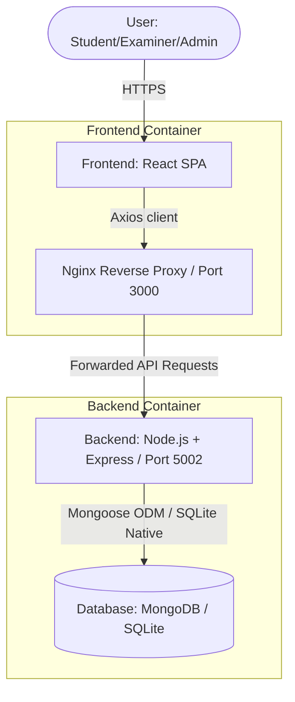

### 3.2 Deployment Pipeline Architecture
This diagram traces the flow of code from a local developer commit to the automated deployment of production containers.

```mermaid
flowchart LR
    Dev[Developer Machine] -->|git push| GitHub[GitHub Repo]
    GitHub -->|Webhook Push Event| Ngrok[Ngrok Tunnel]
    Ngrok -->|Forward Payload| Jenkins[Jenkins CI Server]
    subgraph Jenkins Pipeline
        Jenkins --> Checkout[1. SCM Checkout]
        Checkout --> Verify[2. Verify Env]
        Verify --> Install[3. Install Deps]
        Install --> Build[4. Build Frontend]
        Build --> DockerBuild[5. Build Images]
        DockerBuild --> Push[6. Push to Registry]
    end
    Push --> DockerHub[(Docker Hub Registry)]
    DockerHub --> Pull[7. Pull Latest Images]
    Pull --> Compose[8. Docker Compose Deploy]
    Compose --> Production[Production Containers]
```

---

## 4. Frontend Workflow

The frontend client acts as the interactive interface. Below is the workflow for user navigation, API interaction, and state management.

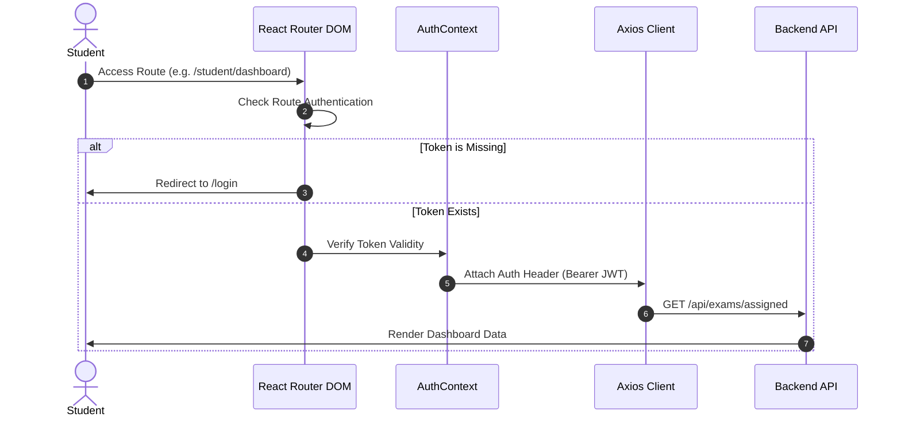

### 4.1 UI Interaction
- **Tab Focus Checking**: The frontend binds event listeners to the browser's window objects:
  ```javascript
  document.addEventListener('visibilitychange', handleVisibilityChange);
  window.addEventListener('blur', handleBlur);
  ```
  Whenever a student navigates to another browser tab or switches windows, a warning counter increments. Upon exceeding the defined threshold, the exam auto-submits.
- **Webcam Integration**: The browser accesses the student's hardware camera and sends snapshots (base64 strings) back to the server at random intervals.

### 4.2 Routing Process
- Controlled via `react-router-dom` using custom route protectors:
  - `ProtectedRoute`: Checks if the user is authenticated and if their `role` matches the route privileges.
  - Redirects unauthorized students to `/login` and unauthorized examiners to `/unauthorized`.

### 4.3 API Communication
- Centralized Axios client located in [api.js](file:///Users/mohammadasif/Downloads/fullstack/frontend/src/services/api.js).
- Interceptors hook into all outgoing requests to append the JWT token from `localStorage` under `Authorization: Bearer <token>`.

### 4.4 Authentication Flow
1. User enters username and password in the login view.
2. Credentials are submitted to `/api/auth/login`.
3. Upon success, the JWT token and user profile object are saved in `localStorage`.
4. Global state (`AuthContext`) updates, causing the router to permit access.

---

## 5. Backend Workflow

The backend server processes incoming HTTP request payloads, validates user context, queries the database, and returns standard HTTP responses.

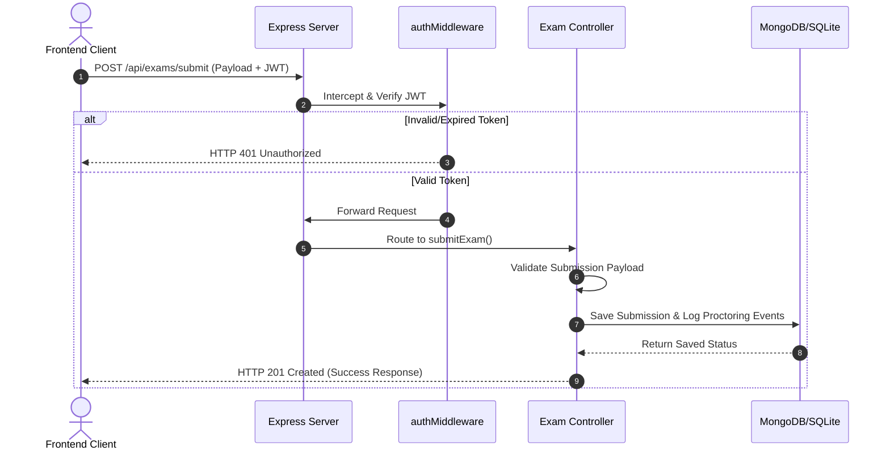

### 5.1 Request Lifecycle
1. **Entry**: Express receives HTTP requests via defined routes.
2. **Body Parsing**: System parses JSON payloads up to `50mb` (supporting image upload limits).
3. **CORS Interception**: Checks if request domains match whitelist policies.
4. **Authentication Check**: Middleware checks the request headers.
5. **Controller Processing**: Executes queries via model structures.
6. **Response Generation**: Serializes results into JSON outputs.
7. **Error Interception**: Any exceptions are captured by custom global error middleware, returning descriptive errors.

---

## 6. Authentication Workflow

Security relies on secure validation protocols. Here is the step-by-step authentication and route protection system.

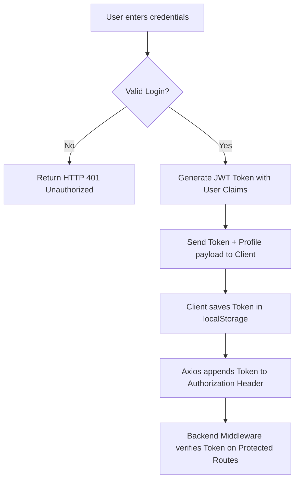

### 6.1 Token Generation and Verification
- **Signing**: Done on login/registration success:
  ```javascript
  const token = jwt.sign({ id: user.id, role: user.role }, JWT_SECRET, { expiresIn: '24h' });
  ```
- **Validation**: Performed by `authMiddleware.js` on incoming protected routes:
  ```javascript
  const token = req.headers.authorization?.split(' ')[1];
  const verified = jwt.verify(token, JWT_SECRET);
  req.user = verified;
  ```

---

## 7. Docker Workflow

### 7.1 Why Docker is Used
- **Consistency**: Eliminates configuration drift ("works on my machine" bugs) by wrapping dependencies, paths, and runtimes inside identical container layers.
- **Isolation**: Keeps database configurations, proxy routes, and static assets separate.
- **Portability**: Allows deployment across developer machines, local Jenkins agents, and cloud servers.

### 7.2 Frontend Multi-stage Dockerfile Workflow
Our [frontend/Dockerfile](file:///Users/mohammadasif/Downloads/fullstack/frontend/Dockerfile) utilizes a multi-stage compilation flow to minimize final image footprint:

```mermaid
graph LR
    subgraph Build Stage (Node:20-alpine)
        Source[React Source Code] --> Install[npm install]
        Install --> Build[Vite Compile]
        Build --> Output[Static dist/ files]
    end
    subgraph Production Stage (Nginx:alpine)
        Output --> Copy[Copy Static dist/ -> /usr/share/nginx/html]
        Config[nginx.conf] --> CopyConfig[Copy config -> /etc/nginx/conf.d]
        CopyConfig --> NginxRun[Nginx Serves Port 80]
    end
```

### 7.3 Backend Dockerfile Workflow
Our [backend/Dockerfile](file:///Users/mohammadasif/Downloads/fullstack/backend/Dockerfile) packs the server runtime environment:
1. Installs minimal node dependency libraries.
2. Copies codebase source trees.
3. Exposes port `5000` (internally mapped).
4. Launches the Express server instance using `node server.js`.

---

## 8. Docker Compose Workflow

Docker Compose coordinates local multi-container services dynamically. The diagram below details the architecture, networks, volumes, and ports.

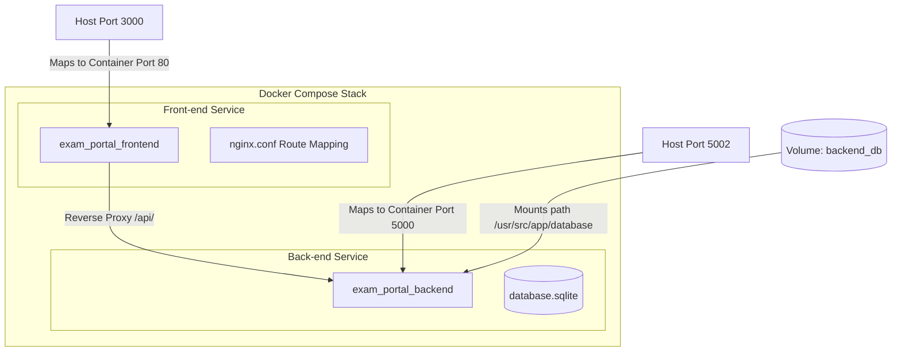

### 8.1 Multi-Container Execution Details
- **Isolated Bridge Network**: Containers communicate by name (e.g. `http://backend:5000` as resolved by Docker's DNS engine).
- **Persistent DB Volume**: A named volume `backend_db` mounts local database directories to prevent data loss when container instances terminate or restart.

---

## 9. CI/CD Pipeline Workflow

The Jenkins pipeline runs declaratively, handling the continuous integration steps.

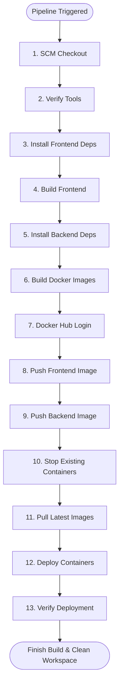

---

### 9.1 Stage-by-Stage Breakdown

#### 1. Checkout Source Code
- **Purpose**: Clones the GitHub project codebase using the SCM checkout rules.
- **Commands**: `checkout scm`
- **Expected Output**: Updated local directory containing the source files.

#### 2. Verify Environment
- **Purpose**: Runs diagnostic checks on required environment binary versions.
- **Commands**: `node --version`, `npm --version`, `docker --version`
- **Expected Output**: Displays versions (e.g. `Node v20.20.2`, `Docker 26.1.4`).

#### 3. Install Frontend Dependencies
- **Purpose**: Installs npm dependencies inside `/frontend`.
- **Commands**: `dir('frontend') { sh 'npm install' }`
- **Expected Output**: Node modules folder successfully populated.

#### 4. Build Frontend
- **Purpose**: Compiles frontend assets into static outputs.
- **Commands**: `dir('frontend') { sh 'npm run build' }`
- **Expected Output**: Production output folder (`dist/`) containing compiled bundles.

#### 5. Install Backend Dependencies
- **Purpose**: Installs npm dependencies inside `/backend`.
- **Commands**: `dir('backend') { sh 'npm install' }`
- **Expected Output**: Backend modules folder successfully populated.

#### 6. Build Docker Images
- **Purpose**: Builds Docker images locally using Docker Compose configurations.
- **Commands**: `sh 'docker compose build'`
- **Expected Output**: Built images `asifaa89/exam-frontend:latest` and `asifaa89/exam-backend:latest`.

#### 7. Docker Login
- **Purpose**: Authenticates Jenkins with Docker Hub.
- **Commands**: `withCredentials(...) { sh 'echo $DOCKER_PASS | docker login -u $DOCKER_USER --password-stdin' }`
- **Expected Output**: `Login Succeeded`.

#### 8. Push Frontend Image
- **Purpose**: Publishes the frontend image to the remote Docker Hub registry.
- **Commands**: `sh 'docker push asifaa89/exam-frontend:latest'`
- **Expected Output**: Image pushed.

#### 9. Push Backend Image
- **Purpose**: Publishes the backend image to the remote Docker Hub registry.
- **Commands**: `sh 'docker push asifaa89/exam-backend:latest'`
- **Expected Output**: Image pushed.

#### 10. Stop Existing Containers
- **Purpose**: Stops active container instances to free ports.
- **Commands**: `sh 'docker compose down || true'`, `sh 'docker rm -f exam_portal_backend exam_portal_frontend || true'`
- **Expected Output**: Port mappings released.

#### 11. Pull Latest Images
- **Purpose**: Ensures local engines pull fresh registry image builds.
- **Commands**: `sh 'docker pull asifaa89/exam-frontend:latest'`, `sh 'docker pull asifaa89/exam-backend:latest'`
- **Expected Output**: Images up to date.

#### 12. Deploy Latest Containers
- **Purpose**: Launches containers in detached mode.
- **Commands**: `sh 'docker compose up -d --remove-orphans'`
- **Expected Output**: Service containers running.

#### 13. Verify Deployment
- **Purpose**: Checks container health.
- **Commands**: `sh 'docker ps'`
- **Expected Output**: Prints active containers.

---

## 10. Git and GitHub Workflow

To keep the repository codebase clean, developers adhere to the following Git workflow.

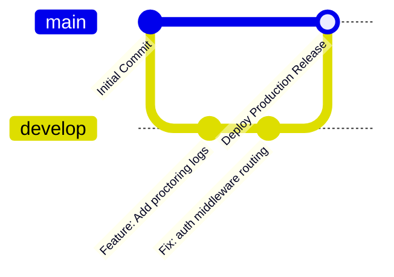

### 10.1 Branching Strategy
- **`main`**: Production-ready branch. Only accepts tested merges.
- **`develop`**: Integration branch for new features.
- **`feature/*`**: Short-lived branches dedicated to developing specific features.

---

## 11. GitHub Webhook Workflow

Webhooks allow GitHub to notify Jenkins automatically when code changes.

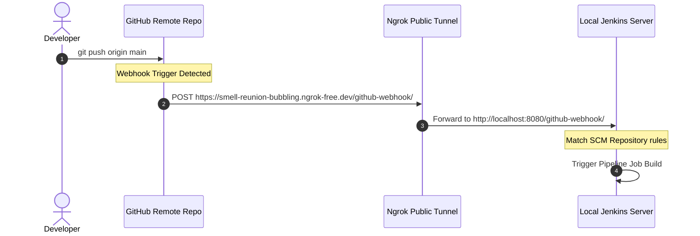

---

## 12. Nginx Workflow

Nginx serves as the frontend server and API reverse proxy.

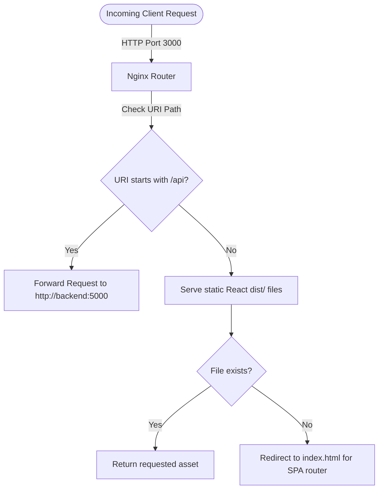

---

## 13. End-to-End Application Workflow

This diagram maps the entire workflow from a developer writing code to a user accessing the deployed application.

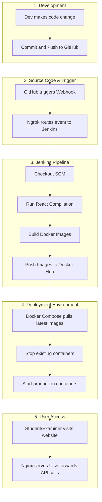

---

## 14. Project Directory Structure

Below is the directory structure layout for the full-stack system:

```
fullstack/
├── frontend/                         # React Frontend Application
│   ├── public/                       # Graphic assets, illustration vector
│   ├── src/                          # React context, assets, services, pages
│   │   ├── assets/                   # Local frontend assets
│   │   ├── components/               # Custom UI Components
│   │   ├── context/                  # Global Contexts (AuthContext, ExamContext)
│   │   ├── pages/                    # Portals (Student, Examiner, Superadmin)
│   │   └── services/                 # Centralized API fetch service (api.js)
│   ├── .env.example
│   ├── Dockerfile                    # Multi-stage production Nginx container build
│   ├── nginx.conf                    # Nginx routes proxy and SPA fallback routing
│   ├── package.json
│   └── vite.config.js
│
├── backend/                          # Node.js/Express API Backend
│   ├── src/
│   │   ├── config/                   # Configs (db.js SQLite connection)
│   │   ├── controllers/              # [Placeholder] Controllers
│   │   ├── middleware/               # Auth validator (authMiddleware.js)
│   │   ├── models/                   # [Placeholder] Data Models
│   │   ├── routes/                   # Routing endpoints (auth.js, exams.js)
│   │   ├── services/                 # [Placeholder] Services
│   │   ├── validations/              # [Placeholder] Schema validations
│   │   └── utils/                    # [Placeholder] Helper scripts
│   ├── database/                     # Host sqlite db mount folder
│   │   └── database.sqlite
│   ├── .env.example
│   ├── Dockerfile                    # Production node container build
│   └── package.json
│
├── jenkins/
│   └── Jenkinsfile                   # Declarative Jenkins CI/CD pipeline
│
├── scripts/                          # Host deployment scripts
│   ├── deploy.sh
│   └── cleanup.sh
│
├── docs/                             # Setup documentation and guides
│   ├── architecture/
│   │   └── README.md                 # Architecture breakdown guide
│   ├── screenshots/                  # Submitted verification screenshots
│   └── setup-guide.md                # Multi-host setup instruction manual
│
├── .dockerignore                     # Global docker ignore rules
├── .gitignore                        # Global git ignore rules
├── docker-compose.yml                # Main multi-container orchestrator
└── LICENSE                           # MIT License file
```

---

## 15. Features

- **Automated Tab Proctoring**: Monitors browser tab switching. Increments warnings and auto-submits tests on breach.
- **Dynamic Assessment Creator**: Allows examiners to design multi-question exams with timing controls and subject categorization.
- **Live Grading Console**: Facilitates examiner grading with automatic result publishing to student dashboards.
- **Audit Logging**: Keeps an audit log of user actions and integrity violations.
- **System Maintenance Controls**: Allows administrators to toggle settings, view logs, and perform safe database resets.

---

## 16. Security Features

- **JSON Web Tokens (JWT)**: Ensures stateless authentication. Tokens are signed server-side and validated on every API call.
- **Password Hashing**: Utilizes `bcryptjs` to hash credentials before database storage.
- **Protected Client Routes**: React Router checks role permissions, blocking access to administrative panels.
- **Container Isolation**: Application processes run in isolated container environments, shielding the host system.

---

## 17. Future Enhancements

- **Object Storage Snapshots**: Upload proctoring snapshots directly to cloud storage (e.g. AWS S3).
- **Auto-Scale Clustering**: Deploy to Kubernetes (EKS) to dynamically scale resources based on concurrent exam volume.
- **Unified Observability**: Integrate Prometheus and Grafana to track server metrics, API latencies, and system health in real time.
