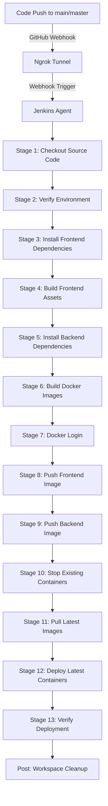

# Architecture & Workflow Design

This document details the system design, network configurations, and the automated integration sequence that powers the ExamPortal application.

---

## 1. Application Architecture

ExamPortal follows a standard split-tier decoupled architecture:

```
  ┌────────────────────────────────────────────────────────┐
  │                   CLIENT WEB BROWSER                   │
  │  (React.js Single Page Application on Host Port 3000)  │
  └──────────────────────────┬─────────────────────────────┘
                             │
                      HTTP /api Requests
                             │
                             ▼
  ┌────────────────────────────────────────────────────────┐
  │                 REVERSE PROXY (NGINX)                  │
  │     (Frontend Container intercepting /api requests)     │
  └──────────────────────────┬─────────────────────────────┘
                             │
                 Proxies internally to backend:5000
                             │
                             ▼
  ┌────────────────────────────────────────────────────────┐
  │                   EXPRESS API SERVER                   │
  │           (Backend Container on Port 5000)             │
  └──────────────────────────┬─────────────────────────────┘
                             │
                     SQL Queries / Writes
                             │
                             ▼
  ┌────────────────────────────────────────────────────────┐
  │                    SQLITE DATABASE                     │
  │          (Stored in persistent Docker Volume)          │
  └────────────────────────────────────────────────────────┘
```

- **Frontend Container**: The React files are compiled down to static HTML, JS, and CSS files during build time. An Alpine-based Nginx container hosts these static files. Nginx acts as both the file server and a reverse proxy, mapping `/api` endpoints directly to the backend service.
- **Backend Container**: An Express Node service exposes API endpoints. The app processes session validation using JSON Web Tokens (JWT) and manages test logic.
- **Database Storage**: The SQLite database file resides in a dedicated folder `backend/database/` which maps directly to a Docker named volume (`backend_db`), ensuring transactions are preserved.

---

## 2. CI/CD Pipeline Workflow

The integration pipeline executes in isolated, sequential stages to ensure build validity before deployment:



- **Docker Image Registry**: Docker Hub serves as our continuous delivery registry. Jenkins builds the local image using Compose, tags it with the repository target (`username/exam-frontend` and `username/exam-backend`), pushes it, and triggers a pull-and-deploy cycle.
- **Fail-Safe Pipeline Execution**: If any verification step (e.g. dependency installation or build compiler check) fails, the Jenkins pipeline immediately halts to prevent corrupt images from replacing current active server containers.
- **Secure Credentials Hook**: Authentication keys are protected via Credentials Binding. Docker login credentials are securely fed via shell stdin pipes to prevent credential leakage.
