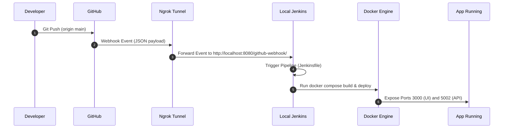

# GitHub Webhook & Ngrok Integration Guide

This guide walks you through exposing your local Jenkins server to the internet using **Ngrok** and configuring a **GitHub Webhook** to automatically trigger the Jenkins CI/CD pipeline on every code push.

---

## Architecture Flow



---

## Setup Steps

### Step 1: Run Ngrok to Expose Jenkins
Since Jenkins runs locally on port `8080`, we need a secure public tunnel for GitHub to talk to it.

1. **Install Ngrok** (if not already installed):
   - **macOS (via Homebrew)**:
     ```bash
     brew install ngrok/ngrok/ngrok
     ```
   - **Windows / Linux**: Download from the official [Ngrok Website](https://ngrok.com/download).

2. **Expose port 8080:**
   ```bash
   ngrok http 8080
   ```

3. **Copy the Public URL:**
   Ngrok will display a terminal interface showing a public address, similar to:
   ```
   Forwarding   https://xxxx-xxxx.ngrok-free.app -> http://localhost:8080
   ```
   Save this `https://xxxx-xxxx.ngrok-free.app` URL.

---

### Step 2: Configure Jenkins Build Trigger
1. Open your Jenkins Dashboard (`http://localhost:8080`).
2. Navigate to your Pipeline Project and click **Configure**.
3. Under **General**, select **GitHub project** and enter your repository URL:
   `https://github.com/your-username/your-repo-name/`
4. Scroll down to **Build Triggers** and check:
   - **GitHub hook trigger for GITScm polling**
5. Save the configurations.

---

### Step 3: Add Webhook to GitHub Repository
1. Navigate to your repository page on GitHub.
2. Go to **Settings** → **Webhooks** → **Add webhook**.
3. Fill in the following details:
   - **Payload URL**: Enter your Ngrok address with `/github-webhook/` appended at the end:
     ```
     https://xxxx-xxxx.ngrok-free.app/github-webhook/
     ```
     *(Note: The trailing slash is required by Jenkins).*
   - **Content type**: Select `application/json`.
   - **Secret**: Leave blank (unless configured in Jenkins credentials).
   - **Which events...**: Select **Just the push event**.
   - **Active**: Check the box to enable it.
4. Click **Add Webhook**.
5. Refresh the page to verify that a green checkmark appears next to the webhook, indicating a successful ping connection.

---

### Step 4: Verify Automation (Testing)
Test the automatic trigger from your local terminal:

1. **Modify a file** (e.g. edit `README.md` or change a label).
2. **Commit and Push:**
   ```bash
   git add .
   git commit -m "Testing automatic CI/CD trigger"
   git push origin main
   ```
3. **Verify:**
   - Watch the Jenkins dashboard; a new build should start automatically within seconds.
   - Access **Build History** → **Console Output** to monitor the pipeline executing checkout, installs, Docker builds, and deployment verification.
   - Run `docker ps` to ensure your containers are up and serving traffic:
     - Frontend: http://localhost:3000
     - Backend: http://localhost:5002
